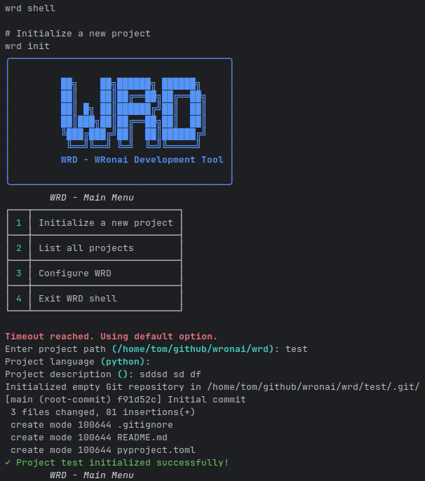

<div align="center">
  <h1>WRD (WRonai Development)</h1>
  <p>A powerful workflow automation tool for developers</p>
  
  [](https://pypi.org/project/wrd/)
  [](https://www.python.org/)
  [](LICENSE)
  
  [Documentation](https://wronai.github.io/wrd) |
  [Examples](https://github.com/wronai/wrd/tree/main/examples) |
  [Report Bug](https://github.com/wronai/wrd/issues)
</div>

## 🚀 Features

- **Project Templates**: Quickly bootstrap projects with pre-configured templates
- **Interactive Shell**: User-friendly command-line interface with rich menus
- **Multi-language Support**: Works with Python, JavaScript, and more
- **Customizable**: Create and share your own templates
- **PWA Support**: Generate single-file Progressive Web Apps
- **Git Integration**: Automatic Git repository initialization
- **Configuration**: Simple YAML-based configuration
- **Claude Code Integration**: Seamless integration with Claude Code AI assistant

## Features

- 🚀 **Project Management**: Create and manage projects with a single command
- 📝 **Automatic Documentation**: Generate and maintain project documentation
- 🤖 **AI Integration**: Optimized for working with AI coding assistants
- 🔄 **Workflow Automation**: Automate repetitive tasks
- ⏱️ **Session Monitoring**: Track your coding sessions
- 💾 **Backup System**: Keep your work safe with automated backups
- 📊 **Progress Tracking**: Monitor your project's progress

## Installation

### Prerequisites

- Python 3.8 or higher
- Git
- pip (Python package manager)

### Using pip (recommended)

```bash
pip install wrd-tool
```

### From source
```bash
# Clone the repository
git clone https://github.com/wronai/wrd.git
cd wrd

# Install in development mode
pip install -e .
```

## Quick Start

### Create a new project
```bash
wrd create my-awesome-project --type python --description "My awesome project"
```

### List all projects
```bash
wrd list
```

### Update project progress
```bash
wrd progress my-awesome-project "Initial setup complete"
```

### Create a backup
```bash
wrd backup
```

## Project Structure

When you create a new project, the following structure is generated:

```
my-awesome-project/
├── .git/
├── .gitignore
├── README.md
├── CLAUDE.md
├── requirements.txt
├── src/
│   └── __init__.py
├── tests/
│   └── __init__.py
└── .wrd/
    └── config.json
```

## 🤖 Claude Code Integration

WRD works seamlessly with [Claude Code](https://www.anthropic.com/product/claude-code), an AI coding assistant. Follow these steps to set up Claude Code with WRD:

### Quick Setup

1. Install Claude Code globally:
   ```bash
   npm install -g @anthropic-ai/claude-code
   ```

2. Authenticate with your preferred method:
   - Anthropic Console (requires billing)
   - Claude Pro/Max subscription
   - Enterprise platforms (Bedrock/Vertex AI)

3. Initialize a new project with WRD and Claude Code:
   ```bash
   wrd create my-ai-project --type python
   cd my-ai-project
   claude
   ```

4. Use the `/init` command in the Claude Code interface to generate project-specific documentation.

For detailed installation instructions, troubleshooting, and advanced configuration, see our [Claude Code Setup Guide](./docs/how-to-guides/claude-code-setup.md).

## Documentation

For detailed documentation, please visit our [documentation site](https://wronai.github.io/wrd/).

## Contributing

Contributions are welcome! Please read our [contributing guidelines](CONTRIBUTING.md) before submitting pull requests.

1. Fork the repository
2. Create a feature branch (`git checkout -b feature/amazing-feature`)
3. Commit your changes (`git commit -m 'Add some amazing feature'`)
4. Push to the branch (`git push origin feature/amazing-feature`)
5. Open a Pull Request

## License

This project is licensed under the Apache License 2.0 - see the [LICENSE](LICENSE) file for details.

## Support

For support, please open an issue in the [issue tracker](https://github.com/wronai/wrd/issues).

## Acknowledgments

- Inspired by Claude Code workflow
- Built with ❤️ by the WRonai team

## 📦 Features

- **Project Management**: Create and manage projects with a single command
- **Automatic Documentation**: Generate and maintain project documentation
- **Workflow Automation**: Automate repetitive tasks
- **Session Monitoring**: Track your coding sessions
- **Backup System**: Keep your work safe with automated backups

## 🚀 Installation

### Prerequisites

- Python 3.8 or higher
- Git
- pip (Python package manager)

### Quick Start

1. **Clone the repository**:
   ```bash
   git clone https://github.com/wronai/wrd.git
   cd wrd
   ```

2. **Set up a virtual environment (recommended)**:
   ```bash
   python -m venv venv
   source venv/bin/activate  # On Windows: venv\Scripts\activate
   ```

3. **Install in development mode**:
   ```bash
   pip install -e .
   ```

4. **Verify installation**:
   ```bash
   wrd --help
   ```

## 🛠 Usage

### Basic Commands

```bash
# Show help
wrd --help

# Create a new project
wrd create my-project --description "My awesome project"

# List all projects
wrd list

# Show project status
wrd status

# Update project progress
wrd progress my-project "Initial setup complete"

# Create a backup
wrd backup
```

### Creating a New Project

```bash
# Create a new Python project
wrd create my-python-project --type python --description "My Python project"

# Create a new web project
wrd create my-web-project --type web --description "My Web project"
```

### Project Structure

When you create a new project, the following structure is generated:

```
my-project/
├── .git/
├── .gitignore
├── README.md
├── CLAUDE.md
├── requirements.txt
├── src/
│   └── __init__.py
├── tests/
│   └── __init__.py
└── .wrd/
    └── config.json
```

## 🧪 Testing

Run the test suite with:

```bash
pytest tests/
```

## 📚 Documentation

For detailed documentation, please visit our [documentation site](https://github.com/wronai/wrd/wiki).

## 🤝 Contributing

Contributions are welcome! Please read our [contributing guidelines](CONTRIBUTING.md) before submitting pull requests.

## 📄 License

This project is licensed under the MIT License - see the [LICENSE](LICENSE) file for details.

## 📞 Support

For support, please open an issue in the [issue tracker](https://github.com/wronai/wrd/issues).

---

## Fedora-Specific Setup (Optional)

If you're using Fedora, you can use the following setup script:

```bash
# Run the setup script
curl -fsSL https://raw.githubusercontent.com/wronai/wrd/main/fedora.sh | bash

# Or download and run manually:
wget https://raw.githubusercontent.com/wronai/wrd/main/fedora.sh
chmod +x fedora.sh
./fedora.sh
```

After running the script:
```bash
# Reload your shell configuration
source ~/.bashrc

# Verify the installation
cc-workspace
```

```bash
# Przejdź do workspace
cc-workspace

# Sklonuj repozytorium WRD
git clone https://github.com/wronai/wrd.git
cd wrd

# Utwórz dedykowane środowisko wirtualne dla WRD
python3 -m venv ~/.wrd-env
source ~/.wrd-env/bin/activate

# Instalacja w trybie deweloperskim
pip install -e .

# Dodaj ścieżkę do PATH (w ~/.bashrc)
echo 'export PATH="$HOME/.wrd-env/bin:$PATH"' >> ~/.bashrc
source ~/.bashrc
```

### Metoda B: Instalacja przez pip (gdy będzie dostępne)

```bash
pip install wrd
```

### Metoda C: Budowanie z źródła

```bash
# Pobierz wszystkie pliki WRD
mkdir -p ~/wrd-build
cd ~/wrd-build

# Skopiuj kod główny (plik wrd.py)
# Skopiuj pliki setup (setup.py, pyproject.toml, etc.)
# [Pliki są dostępne w artefaktach Claude]

# Instalacja
python3 -m venv venv
source venv/bin/activate
pip install --upgrade pip setuptools wheel
pip install -e .
```

## Krok 3: Konfiguracja WRD

```bash
# Pierwszy start - automatyczna konfiguracja
wrd status

# Sprawdź czy wszystko działa
wrd list

# Utwórz pierwszy projekt testowy
wrd create test-project --description "Testowy projekt WRD"

# Sprawdź strukturę
ls -la ~/claude-projects/test-project/
```

## Krok 4: Integracja z Claude Code

### Instalacja Claude Code

1. **Zaloguj się na https://claude.ai**
2. **Przejdź do ustawień → API**
3. **Wygeneruj klucz API** (wymaga Claude Pro)
4. **Pobierz Claude Code CLI** według oficjalnej dokumentacji Anthropic

### Konfiguracja

```bash
# Ustaw klucz API (przykład)
export ANTHROPIC_API_KEY="your-api-key-here"

# Dodaj do ~/.bashrc dla trwałości
echo 'export ANTHROPIC_API_KEY="your-api-key-here"' >> ~/.bashrc

# Sprawdź instalację Claude Code
claude-code --version
```

## Krok 5: Workflow setup

### Tworzenie pierwszego prawdziwego projektu

```bash
# Utwórz projekt
wrd create moj-pierwszy-ai-projekt --type python --description "Pierwszy projekt z Claude Code"

# Przejdź do projektu
cd ~/claude-projects/moj-pierwszy-ai-projekt

# Aktywuj środowisko Python
source venv/bin/activate

# Zainicjalizuj git
git init
git add .
git commit -m "Initial commit via WRD"

# Edytuj CLAUDE.md - dodaj specyfikację projektu
nano CLAUDE.md

# Zacznij pracę z Claude Code
claude-code init  # lub odpowiednia komenda
```

### Testowanie workflow

```bash
# Test 1: Tworzenie kodu
echo "print('Hello from WRD!')" > src/main.py

# Test 2: Aktualizacja postępu
wrd progress moj-pierwszy-ai-projekt "Dodano główny plik aplikacji"

# Test 3: Automatyczny commit
wrd commit moj-pierwszy-ai-projekt --message "Dodanie main.py"

# Test 4: Backup
wrd backup

# Test 5: Status
wrd status
```

## Krok 6: Integracja z innymi narzędziami

### Cursor IDE

```bash
# Jeśli masz Cursor zainstalowany
cursor ~/claude-projects/moj-pierwszy-ai-projekt
```

### Gemini CLI (opcjonalnie)

```bash
# Instalacja Gemini CLI według dokumentacji Google
# Konfiguracja w WRD
nano ~/.wrd/config.json
# Ustaw "gemini_cli": {"enabled": true, "priority": 2}
```

### SSH dla zdalnej pracy

```bash
# Sprawdź czy SSH działa
sudo systemctl status sshd

# Test połączenia z telefonu/innego urządzenia
ssh wronai@your-fedora-ip

# Na zdalnym urządzeniu:
cc-workspace
wrd status
```

## Krok 7: Zaawansowana konfiguracja

### Aliasy i funkcje pomocnicze

Dodaj do `~/.bashrc`:

```bash
# WRD shortcuts
alias w='wrd'
alias ws='wrd status'
alias wl='wrd list'
alias wp='wrd progress'
alias wb='wrd backup'

# Claude Code shortcuts
alias cc='claude-code'
alias ccd='claude-code dev'
alias ccb='claude-code build'

# Combined workflow functions
wcc-start() {
    wrd create "$1" --type "${2:-python}" --description "${3:-AI project}"
    cd ~/claude-projects/"$1"
    source venv/bin/activate
    echo "Projekt $1 gotowy. Uruchom: claude-code dev"
}

wcc-session() {
    cd ~/claude-projects/"$1" || { echo "Projekt nie istnieje"; return 1; }
    source venv/bin/activate
    echo "Sesja $1 uruchomiona. Czas: $(date)"
    wrd progress "$1" "Rozpoczęcie sesji $(date '+%H:%M')"
}
```

### Automatyczne backup

```bash
# Dodaj cron job dla automatycznych backup (opcjonalnie)
(crontab -l 2>/dev/null; echo "0 */6 * * * /home/$USER/.wrd-env/bin/wrd backup > /dev/null 2>&1") | crontab -
```

### Monitoring sesji

```bash
# Skrypt do monitorowania czasu sesji (5h limit Claude Code)
cat > ~/claude-projects/scripts/session-monitor.sh << 'EOF'
#!/bin/bash
echo "⏰ Monitor sesji Claude Code (limit 5h)"
start_time=$(date +%s)
while true; do
    current_time=$(date +%s)
    elapsed=$((current_time - start_time))
    hours=$((elapsed / 3600))
    minutes=$(((elapsed % 3600) / 60))
    
    if [ $hours -ge 4 ]; then
        echo "⚠️  UWAGA: Zbliżasz się do limitu! Czas: ${hours}h ${minutes}m"
    fi
    
    if [ $hours -ge 5 ]; then
        echo "🛑 LIApache OSIĄGNIĘTY! Reset za $(date -d '+5 hours' '+%H:%M')"
        break
    fi
    
    sleep 300  # Check every 5 minutes
done
EOF

chmod +x ~/claude-projects/scripts/session-monitor.sh
```

## Krok 8: Rozwiązywanie problemów

### Problem: Brak uprawnień Docker

```bash
sudo usermod -aG docker $USER
newgrp docker
# lub zaloguj się ponownie
```

### Problem: Python venv nie działa

```bash
# Reinstalacja python3-venv
sudo dnf reinstall python3-venv
# Usuń stare środowisko
rm -rf ~/.wrd-env
# Stwórz nowe
python3 -m venv ~/.wrd-env
source ~/.wrd-env/bin/activate
pip install -e ~/wrd-build/
```

### Problem: Claude Code nie działa

```bash
# Sprawdź klucz API
echo $ANTHROPIC_API_KEY

# Sprawdź połączenie internetowe
curl -s https://api.anthropic.com/v1/messages

# Sprawdź wersję
claude-code --version
```

### Problem: Brak miejsca na dysku

```bash
# Wyczyść stare backup
wrd backup  # Nowy backup
rm ~/claude-projects/archive/backup-*.tar.gz.old

# Wyczyść cache pip
pip cache purge

# Wyczyść Docker (jeśli używasz)
docker system prune -a
```

## Krok 9: Pierwsze prawdziwe użycie

### Scenariusz: Projekt w 48h (konkurs)

```bash
# Dzień 1 - Setup (wieczór)
wcc-start konkurs-super-app fastapi "Aplikacja konkursowa - API + Frontend"

# Otwórz Claude.ai w przeglądarce
# Stwórz szczegółową specyfikację
# Skopiuj do CLAUDE.md

# Dzień 2 - Sesja #1 (rano, 5h)
wcc-session konkurs-super-app
# Uruchom session-monitor w drugim terminalu
~/claude-projects/scripts/session-monitor.sh &
# Rozpocznij pracę z Claude Code
claude-code dev

# Po sesji
wrd progress konkurs-super-app "Sesja 1 zakończona - podstawowa struktura API"
wrd commit konkurs-super-app "Implementacja podstawowego API"

# Dzień 2 - Sesja #2 (po przerwie, 3h)
# Podobnie jak wyżej...

# Finalizacja
wrd progress konkurs-super-app "Aplikacja gotowa do zgłoszenia!"
wrd backup
```

### Scenariusz: Długoterminowe narzędzie

```bash
# Tydzień 1
wcc-start moje-cli-tool python "Autorskie narzędzie CLI"
# Rozwój iteracyjny...

# Tydzień 2  
wrd progress moje-cli-tool "Tydzień 2 - dodano funkcje X, Y, Z"

# Tydzień 3
wrd progress moje-cli-tool "Tydzień 3 - optymalizacja i testy"
```

## 🎉 Gratulacje!

Masz teraz w pełni skonfigurowane środowisko WRD na Fedorze z integracją Claude Code. 

**Następne kroki:**
1. Stwórz pierwszy prawdziwy projekt
2. Przetestuj workflow 5-godzinnych sesji
3. Rozwijaj własne techniki i flow
4. Dokumentuj wszystko w CLAUDE.md
5. Dziel się doświadczeniami z community!

**Przydatne komendy do zapamiętania:**
- `wrd status` - sprawdź status
- `wcc-start nazwa typ` - nowy projekt + sesja
- `wrd progress projekt "opis"` - zaktualizuj postęp  
- `wrd backup` - zabezpiecz pracę

