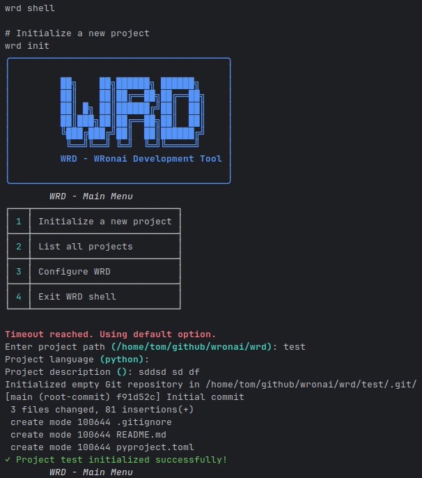

# WRD (WRonai Development)



## Spis treści
1. [Wprowadzenie](#wprowadzenie)
2. [Szybki start](#szybki-start)
3. [Funkcjonalności](#funkcjonalności)
4. [Wymagania systemowe](#wymagania-systemowe)
5. [Dokumentacja](#dokumentacja)
6. [Rozwój](#rozwój)
7. [Licencja](#licencja)

## Wprowadzenie

WRD to zaawansowane środowisko programistyczne umożliwiające pracę z modelami językowymi Claude w wygodnym środowisku VS Code dostępnym przez przeglądarkę. System jest w pełni konteneryzowany i gotowy do użycia od razu po skonfigurowaniu.

## Szybki start

1. Sklonuj repozytorium:
   ```bash
   git clone https://github.com/wronai/wrd.git
   cd wrd
   ```

2. Skonfiguruj plik `.env`:
   ```bash
   cp .env.example .env
   # Edytuj plik .env i ustaw swój klucz API
   ```

3. Uruchom środowisko:
   ```bash
   docker-compose -f docker-compose.claude-code.yml up -d
   ```

4. Otwórz przeglądarkę pod adresem: http://localhost:8083

## Funkcjonalności

- Pełne środowisko VS Code w przeglądarce
- Integracja z modelami Claude
- Narzędzia wiersza poleceń (CLI)
- Gotowe szablony projektów
- Automatyczna konfiguracja środowiska

## Wymagania systemowe

- Docker 20.10+
- Docker Compose 2.0+
- 4GB wolnej pamięci RAM
- 2GB wolnego miejsca na dysku

## Dokumentacja

Szczegółowa dokumentacja dostępna jest w katalogu `docs/`:

1. [Wprowadzenie](docs/01-wprowadzenie.md)
2. [Instalacja](docs/02-instalacja.md)
3. [Konfiguracja](docs/03-konfiguracja.md)
4. [Korzystanie z VS Code](docs/04-uzycie-vscode.md)
5. [Interfejs wiersza poleceń](docs/05-cli.md)
6. [Modele Claude](docs/06-modele-claude.md)
7. [Rozwój](docs/07-rozwoj.md)
8. [Rozwiązywanie problemów](docs/08-rozwiazywanie-problemow.md)

## Rozwój

Zapraszamy do współtworzenia projektu! Więcej informacji w [dokumentacji dla programistów](docs/07-rozwoj.md).

## Licencja

Projekt objęty jest licencją MIT. Szczegóły w pliku [LICENSE](LICENSE).
